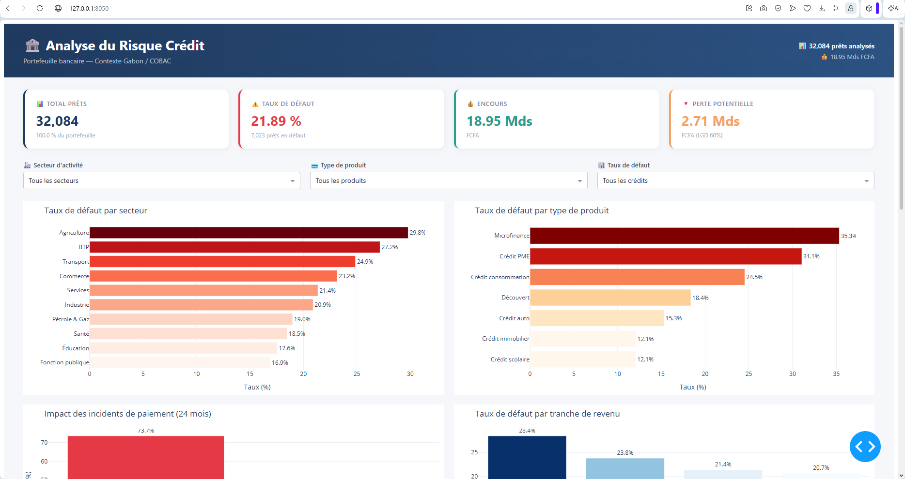
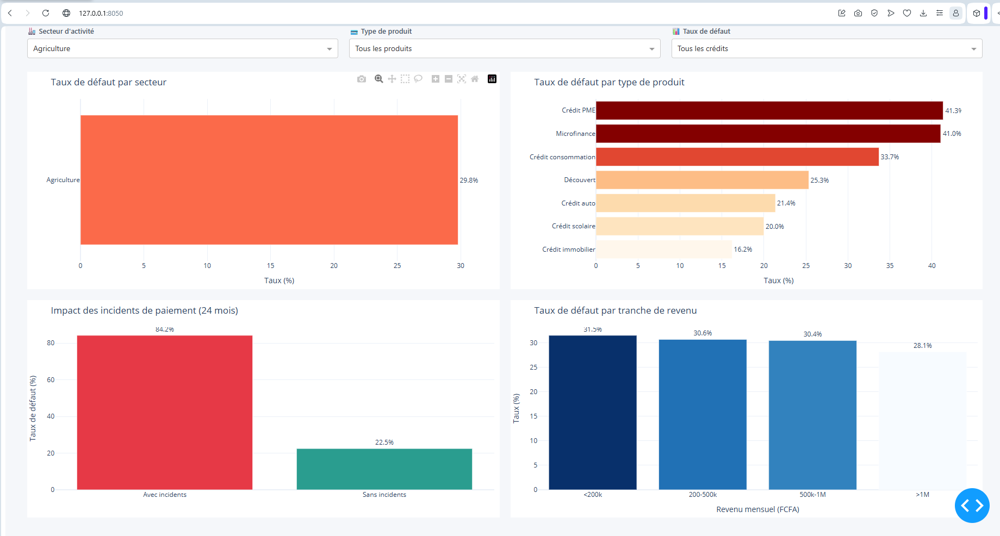
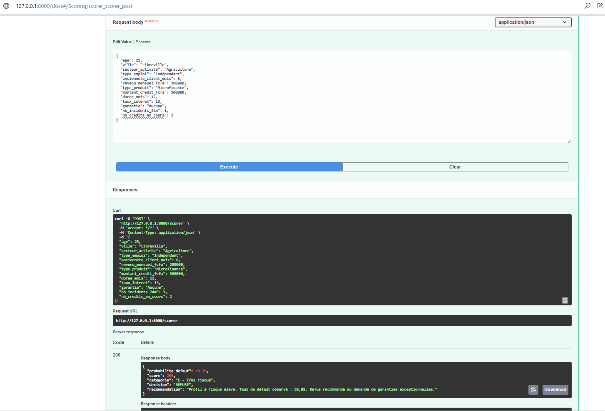
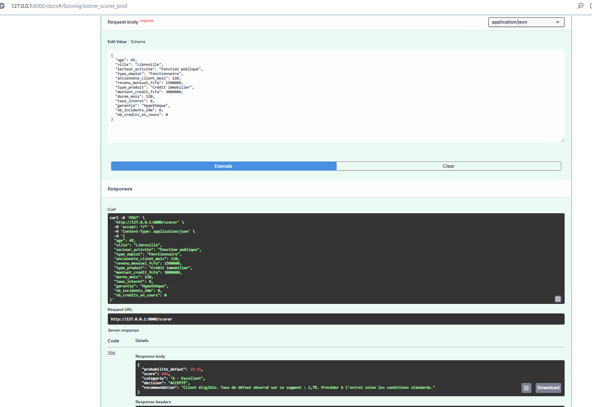

# 🏦 Analyse du Risque Crédit Bancaire — Contexte Gabon

[](https://www.python.org/)
[](https://pandas.pydata.org/)
[](https://plotly.com/)
[](https://dash.plotly.com/)
[](https://fastapi.tiangolo.com/)
[](https://scikit-learn.org/)
[](https://www.sqlite.org/)
[](LICENSE)

> Système complet d'aide à la décision pour l'analyse du risque crédit bancaire, adapté au contexte gabonais et conforme aux principes de classification **COBAC**.

---

## 🎯 Objectif

Construire un **système complet** d'analyse et de scoring du risque crédit :
- **Analyser** un portefeuille de 32 084 crédits bancaires
- **Identifier** les facteurs de risque par segment, secteur et produit
- **Prédire** la probabilité de défaut via un modèle ML
- **Exposer** un scoring en temps réel via une API REST
- **Produire** un reporting réglementaire COBAC automatique

---

## 📊 Résultats clés

| Indicateur | Valeur |
|-----------|--------|
| 📥 Observations initiales | **32 581** |
| ✨ Observations après nettoyage | **32 084** |
| 📉 Taux de défaut global | **21,89 %** |
| 💰 Encours total | **18,95 Mds FCFA** |
| 🔻 Perte potentielle (LGD 60 %) | **2,71 Mds FCFA** |
| 🤖 AUC-ROC du modèle ML | **0,818** |

### 🔍 Facteurs de risque identifiés

| Facteur | Impact observé |
|---------|----------------|
| ⚠️ **Incidents de paiement (24 mois)** | **× 5** de risque (73,66 % vs 14,78 %) |
| 💳 **Microfinance / Crédit PME** | 35,3 % / 31,1 % de défaut |
| 🏭 **Secteur Agriculture / BTP** | 29,8 % / 27,2 % de défaut |
| 📊 **Ratio d'effort élevé** | Corrélation +0,14 |

### 🎯 Top 3 facteurs prédictifs (modèle ML)

| Rang | Facteur | Importance |
|------|---------|-----------|
| 1 | Incidents de paiement (24 mois) | **42,10 %** |
| 2 | Ancienneté client | 10,57 % |
| 3 | Type de produit | 7,62 % |

---

## 🏛️ Matrice COBAC (simulation)

| Catégorie | Part portefeuille | Taux de défaut observé |
|-----------|-------------------|------------------------|
| 1. Saine | 86,16 % | **14,10 %** ✅ |
| 2. Observation | 0,77 % | 35,48 % ⚠️ |
| 3. Douteuse | 12,45 % | **72,62 %** 🔴 |
| 4. Litigieuse | 0,62 % | 68,84 % 🔴 |

> Le système **sépare efficacement** les bons clients (Saine : 14 %) des mauvais (Douteuse : 73 %) — **écart de 5×**.

---

## 🤖 Modèle de scoring ML

### Modèles comparés

| Modèle | AUC-ROC |
|--------|---------|
| Logistic Regression (baseline) | 0,760 |
| **Random Forest** 🏆 | **0,818** |
| XGBoost | 0,815 |

**Meilleur modèle : Random Forest** — AUC 0,818, précision 0,62, rappel 0,58.

### Seuils calibrés sur la distribution réelle

| Zone | Score | % clients | Taux défaut réel observé |
|------|-------|-----------|--------------------------|
| ✅ **ACCEPTÉ** | ≥ 724 | 35,3 % | **2,74 %** |
| ⚠️ **À EXAMINER** | 587 - 723 | 34,9 % | 9,70 % |
| ❌ **REFUSÉ** | < 587 | 29,8 % | **58,79 %** |

> En refusant les **30 %** les plus risqués, la banque évite **79 %** des défauts.

---

## 🛠️ Architecture du projet

```
credit-risk-gabon/
├── data/
│   ├── raw/                      # Données brutes
│   └── processed/                # Données nettoyées
├── database/
│   └── credit_risk.db            # Base SQLite
├── models/
│   └── scoring_model.pkl         # Modèle ML entraîné
├── src/
│   ├── data_loader_gabon.py      # Étape 1 : Génération données
│   ├── diagnostic.py             # Étape 2 : Diagnostic
│   ├── cleaning.py               # Étape 3 : Nettoyage
│   ├── eda.py                    # Étape 4 : Analyse exploratoire
│   ├── sql_analysis.py           # Étape 5 : Analyse SQL
│   ├── scoring_model.py          # Étape 6 : Modèle ML
│   ├── reporting.py              # Étape 7 : Rapports COBAC
│   └── calibrer_seuils.py        # Étape 8 : Calibration seuils
├── dashboard/
│   └── app.py                    # Dashboard Dash interactif
├── api/
│   ├── schemas.py                # Schémas Pydantic
│   └── main.py                   # API REST FastAPI
├── reports/
│   ├── eda/                      # 10 graphiques HTML
│   ├── sql/                      # 10 exports CSV
│   ├── rapport_cobac.pdf         # Rapport PDF
│   ├── rapport_cobac.xlsx        # Rapport Excel
│   └── screenshots/              # Captures
├── requirements.txt
└── README.md
```

---

## 🚀 Installation & Lancement

### 1. Cloner le projet
```bash
git clone https://github.com/bisneldev/credit-risk-gabon.git
cd credit-risk-gabon
```

### 2. Créer l'environnement virtuel
```bash
python -m venv venv

# Windows
venv\Scripts\activate

# macOS / Linux
source venv/bin/activate
```

### 3. Installer les dépendances
```bash
pip install -r requirements.txt
```

### 4. Exécuter le pipeline complet

```bash
# Étape 1 : Génération des données
python src/data_loader_gabon.py

# Étape 2 : Diagnostic
python src/diagnostic.py

# Étape 3 : Nettoyage
python src/cleaning.py

# Étape 4 : Analyse exploratoire (10 graphiques HTML)
python src/eda.py

# Étape 5 : Analyse SQL (base SQLite + 10 CSV)
python src/sql_analysis.py

# Étape 6 : Entraînement du modèle ML
python src/scoring_model.py

# Étape 7 : Calibration des seuils de décision
python src/calibrer_seuils.py

# Étape 8 : Génération des rapports COBAC (PDF + Excel)
python src/reporting.py
```

### 5. Lancer le dashboard interactif

```bash
python dashboard/app.py
```
→ Ouvrir dans le navigateur : **http://127.0.0.1:8050**

### 6. Lancer l'API REST

```bash
python -m api.main
```
→ API : **http://127.0.0.1:8000**
→ Documentation Swagger : **http://127.0.0.1:8000/docs**

---

## 📸 Aperçus

### Dashboard interactif


### Focus secteur Agriculture (le plus risqué)


### API REST — Swagger UI


### Scoring d'un client à risque (REFUSÉ)


### Scoring d'un client excellent (ACCEPTÉ)


### Rapport PDF COBAC


---

## 📡 API REST — Endpoints

| Méthode | Endpoint | Description |
|---------|----------|-------------|
| `GET` | `/` | Page d'accueil + liste des endpoints |
| `GET` | `/health` | État de l'API |
| `POST` | `/scorer` | **Scorer un nouveau client** |
| `POST` | `/scorer/batch` | Scorer plusieurs clients (max 100) |
| `GET` | `/kpis` | KPI globaux du portefeuille |
| `GET` | `/secteurs` | Analyse par secteur |
| `GET` | `/produits` | Analyse par produit |
| `GET` | `/modele/info` | Informations sur le modèle ML |
| `GET` | `/docs` | Documentation Swagger UI |

### Exemple d'appel `/scorer`

```bash
curl -X POST http://127.0.0.1:8000/scorer \
  -H "Content-Type: application/json" \
  -d '{
    "age": 35,
    "ville": "Libreville",
    "secteur_activite": "Commerce",
    "type_emploi": "Salarié privé",
    "anciennete_client_mois": 48,
    "revenu_mensuel_fcfa": 600000,
    "type_produit": "Crédit consommation",
    "montant_credit_fcfa": 2000000,
    "duree_mois": 36,
    "taux_interet": 11.5,
    "garantie": "Salaire",
    "nb_incidents_24m": 0,
    "nb_credits_en_cours": 1
  }'
```

**Réponse :**
```json
{
  "probabilite_defaut": 35.91,
  "score": 640,
  "categorie": "C - Moyen",
  "decision": "À EXAMINER",
  "recommandation": "Dossier à examiner par le comité. Taux de défaut observé : 9,7%..."
}
```

---

## 🔬 Stack technique

| Domaine | Outils |
|---------|--------|
| **Langage** | Python 3.10+ |
| **Data** | Pandas, NumPy |
| **Base de données** | SQLite, SQLAlchemy |
| **Visualisation** | Plotly Express, Plotly Graph Objects |
| **Dashboard** | Dash |
| **Modélisation** | Scikit-learn (Random Forest, Logistic Regression), XGBoost |
| **API** | FastAPI, Uvicorn, Pydantic |
| **Reporting** | ReportLab (PDF), XlsxWriter (Excel) |

---

## 🗺️ Roadmap

- [x] Étape 1 — Diagnostic et compréhension des données
- [x] Étape 2 — Nettoyage et préparation
- [x] Étape 3 — Analyse exploratoire (EDA)
- [x] Étape 4 — Analyse SQL / SQLite
- [x] Étape 5 — Dashboard interactif (Dash)
- [x] Étape 6 — Documentation et conclusions
- [x] Étape 7 — Modèle prédictif de scoring
- [x] Étape 8 — Reporting COBAC (PDF/Excel)
- [x] Étape 9 — API REST (FastAPI)
- [ ] Étape 10 — Alertes temps réel sur dégradation de segments
- [ ] Étape 11 — Extension scoring multi-pays CEMAC

---

## 💼 Cas d'usage bancaire

Ce projet répond à des **besoins réels** d'une banque :

1. **Direction des Risques** → pilotage du portefeuille via dashboard
2. **Comité de Crédit** → scoring objectif des nouvelles demandes
3. **Conformité / Réglementaire** → reporting COBAC automatisé
4. **Direction Digitale** → API intégrable au SI existant
5. **Audit Interne** → traçabilité des décisions d'octroi

---

## 👤 Auteur

**Bisneldev**
- 🎓 Ingénierie Financière — Sciences et Techniques Comptables et Financières
- 💼 Finance, Audit, Contrôle de gestion + Développement d'applications
- 📍 Libreville, Gabon
- 📧 bisneldev@gmail.com
- 💼 [LinkedIn](https://www.linkedin.com/in/bisnel-n-078ba5197/)

---

## 📄 Licence

Ce projet est sous licence MIT — voir le fichier [LICENSE](LICENSE) pour plus de détails.

---

⭐ **Si ce projet vous intéresse, n'hésitez pas à laisser une étoile !**